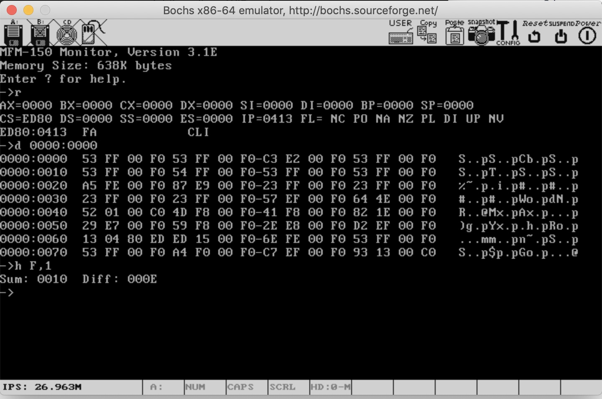

# MFM-150

Disassembly &amp; Recreation of the Zenith MFM-150 "Multi-Function Monitor" ROM Code from the [Z150 BIOS](https://www.vcfed.org/forum/forum/marketplace/vintage-computer-items-wanted/32603-wanted-zenith-pc-xt-rom-bios-files-with-debugger-z-150-etc?32016-Wanted-Zenith-PC-XT-ROM-BIOS-files-with-DEBUGGER-Z-150-etc=).

BIOS ROM code dissassembled using Ghidra and then Monitor parts moved over in sections to be reassembled in NASM to try and just pick out just the MFM-150 parts. Used [PCjs's Z150 Emulation](https://www.pcjs.org/machines/pcx86/zenith/z150/cga/?debugger=true) extensively to step through code and understand how lots of it worked. My NASM syntax is a little odd, as I only modified Ghidra's Assembly output just enough to avoid assembly errors in NASM.

I've also modified the code quite a bit to allow the use of the 2nd 1KB of EBDA RAM as the Zenith Z150 had 32K of 'ScratchPAD' RAM at 0xF0000 - 0xF8000 that it used for it's BIOS and the Monitor. The original code had the MFM-150 variables stored in the Code Segment (CS) and I changed these references to use the Stack Segment (SS) instead, which had been moved to EBDA.

I've also tried to package this as an Option (Extension) ROM for the system so that it isn't so dependant on a custom BIOS to work. The option ROM initialisatoin code sets the Int 18 (BASIC ROM) vector to the MFM-150 boot screen so if you try and boot from ROM (like from XTIDE Universal BIOS), it'll start the MFM-150. It still needs the BIOS to reserve a 2nd 1kB block of EBDA RAM and handle the Ctrl-Alt-Enter keystroke to invoke the debugger that way too. I would have liked the option ROM initialisation code to try and insert a Ctrl+Alt+Enter handler instead of the BIOS, but I don't have the time to experiment with that. One idea I had would have been to use a 'int 9' handler to hook into the IRQ 1 keyboard code, but again, no expeience with this and would have taken a lot of time.

The 'Ctrl-Alt-Enter' Debugger isn't working very well either, and is really just shows that it can start MFM-150 menu. I had to re-write the code jumped to on Ctrl-Alt-Enter as it was harder to store all the CPU registers with the variables being stored in EBDA - much easier when the CS was being used to reference variables. With more work I think the debugger can be made to work fine tho.

The 'TEST' menu doesn't work at all, I started this but was too big and I felt probably too specific to the Z150 to be of much use - I didn't want to have to implement too much of the Z50 BIOS POST code.

Anyway posting my work here incase anyone wants to continue it and maybe get it working more fully on their machine. Would be cool to see this running on a 5150/60 in-place of the CASSETTE BASIC!

Oh, and I'm very sorry for the Comments in the code, they are a total mess and are terrifying details into the workings inside my head at any given moement as I was triyng to make things work! I didn't clean up any of it - again my time is v. limited and can't really spend more time tidying up comment lines... Maybe my mad ramblings with be useful to someone else?

Also, after a point I didn't update the Ghidra project comments and labels and focussed more on the NASM source I'd reconstructed, so they might be a bit out of sync. By the end, I was just using the Ghidra project mainly to check my understanding of the original code whilst stepping thought the PCjs Z150 debugger.

Enjoy!

